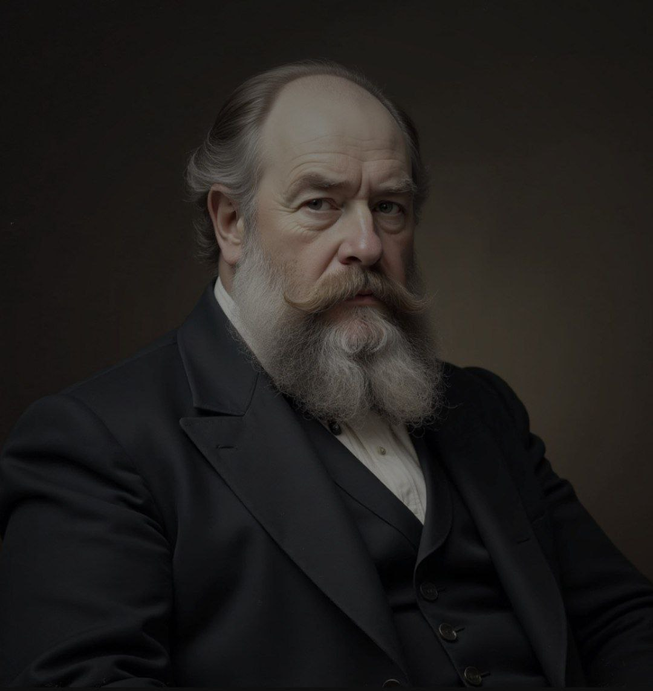

<!DOCTYPE html>
<html lang="ru">
<head>
    <meta charset="UTF-8">
    <meta name="viewport" content="width=device-width, initial-scale=1.0">
    <title>Граф Аркадий Иванович Вяземский-Розанов (1798-1842)</title>
    
</head>
<body>
    <header>
        

            <h1>Граф Аркадий Иванович Вяземский-Розанов</h1>
            
(1798-1842) - Русский поэт и государственный деятель

        

    </header>
    
    

        

            <nav>
                <ul>
                    <li><a href="#biography">Биография</a></li>
                    <li><a href="#collections">Сборники</a></li>
                    <li><a href="#legacy">Наследие</a></li>
                </ul>
            </nav>
        

    

    
    <main class="container">
        <section id="biography" class="content-section">
            <h2>Биография</h2>
            

                

                    

                         
                    

                

                

                    
Граф Аркадий Иванович Вяземский-Розанов (1798-1842) — русский поэт и государственный деятель, яркий представитель позднего романтизма. Родился в знатной дворянской семье, получил прекрасное домашнее образование, что позволило ему с ранних лет проявить интерес к литературе и искусству.

                    
В юности Вяземский-Розанов служил в гвардии и принял активное участие в Отечественной войне 1812 года, где проявил себя как храбрый офицер. Военные впечатления оказали значительное влияние на его дальнейшее творчество.

                    
После войны он оставил военную службу и посвятил себя литературе и государственной деятельности. Вяземский-Розанов был известен своими меланхолическими стихотворениями, в которых часто обращался к темам быстротечности жизни, утраченной любви и социальных условностей.

                    
Его творчество оказало влияние на многих поэтов середины XIX века, хотя при жизни он не получил широкого признания. Граф Вяземский-Розанов скончался в 1842 году, оставив после себя значительное литературное наследие.

                

            

        </section>
        
        <section id="collections" class="content-section">
            <h2>Основные сборники</h2>
            

                

                    <h3 class="collection-title">«Сумрачные элегии» (1825)</h3>
                    
24 стихотворения

                    
Первый значительный сборник поэта, в котором ярко проявились черты его меланхолического стиля. Стихотворения сборника пронизаны мотивами одиночества, разочарования и философских размышлений о смысле бытия.

                

                
                

                    <h3 class="collection-title">«Оранжерейные цветы» (1831)</h3>
                    
18 стихотворений

                    
Сборник, в котором поэт обращается к теме искусственной красоты и хрупкости человеческих чувств. Название сборника метафорически отражает идею защищенной, но лишенной естественности жизни.

                

                
                

                    <h3 class="collection-title">«Бородинские тени» (1837)</h3>
                    
12 стихотворений

                    
Военно-патриотический цикл, посвященный 25-летию Бородинской битвы. В этих стихотворениях Вяземский-Розанов возвращается к теме войны 1812 года, но уже с позиции зрелого человека, размышляющего о жертвах и смысле исторических событий.

                

                
                

                    <h3 class="collection-title">Не вошедшие в сборники</h3>
                    
около 15 стихотворений

                    
Стихотворения, которые по разным причинам не были включены поэтом в основные сборники. Среди них есть как ранние опыты, так и поздние произведения, демонстрирующие эволюцию творческого метода Вяземского-Розанова.

                

            

        </section>
        
        <section id="legacy" class="content-section">
            <h2>Творческое наследие</h2>
            

                
Творчество Графа Аркадия Ивановича Вяземского-Розанова занимает особое место в русской литературе первой половины XIX века. Будучи представителем позднего романтизма, он развивал в своей поэзии традиции, заложенные Жуковским и Батюшковым, но при этом создал уникальный поэтический стиль, отличающийся глубоким психологизмом и философской насыщенностью.

                
Основными темами его поэзии стали быстротечность жизни, утраченная любовь, одиночество творческой личности в обществе, размышления о предназначении человека. Меланхолический тон его стихотворений отражал общее настроение эпохи, последовавшей за наполеоновскими войнами и восстанием декабристов.

                
Хотя при жизни Вяземский-Розанов не получил широкой известности, его творчество оказало влияние на многих поэтов середины XIX века, в частности, на представителей "чистого искусства". В настоящее время его наследие изучается литературоведами как важная часть истории русской романтической поэзии.

            

        </section>
    </main>
    
    <footer>
        

            
© 2023 Сайт посвященный творчеству Графа Аркадия Ивановича Вяземского-Розанова

            
Материалы представлены в образовательных целях

        

    </footer>
</body>
</html>
